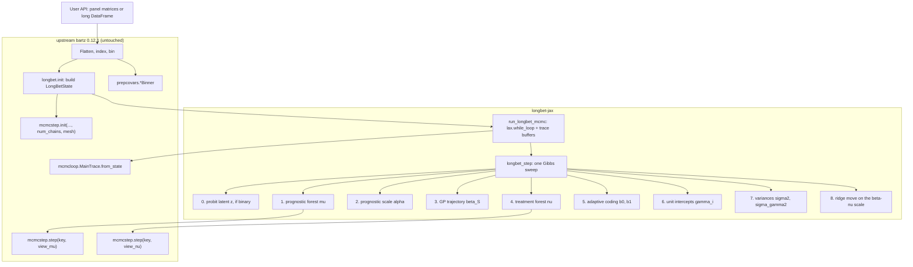

# LongBet-JAX: Implementation Plan

A high-performance, GPU-accelerated implementation of **LongBet** (time-varying
heterogeneous treatment effects in panel data) in Python and JAX, consuming
**`bartz`** as an external dependency.

**One engine, two front doors.** The sampler is written once, in Python. It is
delivered both as a Python package and through the existing R package, so a
user of either language installs one thing and works in the idiom they already
use. §12 specifies that boundary; everything before it describes the engine
both front doors call.

> **Status of this document.** Every claim about the `bartz` API below was
> checked against **`bartz` 0.12.1** (released 2026-08-25, the current PyPI
> release) and against the open BCF pull request
> [bartz-org/bartz#189](https://github.com/bartz-org/bartz/pull/189)
> (branch `feat/bayesian-causal-forests` on `miaoqingyu4/bartz`, head
> `55d461b`, last updated 2026-09-04). Claims about the target model were
> checked against the LongBet chapter of the book (`longbet.qmd`) and the fork
> [`ignacio82/longbet`](https://github.com/ignacio82/longbet) it documents.
> Where the plan depends on `bartz` internals that carry no API stability
> guarantee, it says so.

**Verdict: feasible.** The composition LongBet needs is the one PR #189 already
performs for BCF, and every primitive it requires — per-observation error
scales, a missingness mask, a residual you can overwrite, a step that does not
insist on owning the error variance — exists in released `bartz`. The work that
is genuinely new is the Gaussian process block, the unit intercepts, the panel
bookkeeping, and the forecast. The risks are not architectural; they are
numerical (a squared-exponential Gram matrix in float32), statistical (the
$\beta$–$\nu$ ridge, which a Metropolis sampler traverses *worse* than XBART
does), and operational (tracking a fast-moving upstream through its private
surface).

Delivering it to R users costs little and is settled technology (§12): the
marshalling overhead is milliseconds against a fit measured in minutes. The
cost that is real is **XLA compile latency**, which is fixed rather than
proportional, and which at the book's own panel size (3,000 x 18 = 54,000
cells) can exceed the entire C++ runtime. That is why the R package dispatches
between engines rather than replacing one with the other.

---

## 1. Executive Summary & Architectural Motivation

### 1.1 Why Reimplement LongBet on `bartz`?

The reference implementation of LongBet ([`google/longbet`](https://github.com/google/longbet),
extended in [`ignacio82/longbet`](https://github.com/ignacio82/longbet)) is an R
package wrapping a C++ engine derived from **XBART** (accelerated BART). It is
fast on small and moderate panels. Three things limit it:

1. **Hardware.** Multi-threaded CPU only. On panels with $N \ge 10^5$ and
   $T \ge 20$ ($M = N \times T \ge 2 \times 10^6$) the runtime becomes
   awkward, and there is no path to a GPU.
2. **Sweep-based approximation.** XBART grows a fresh forest each sweep by
   Grow-From-Root rather than walking a Markov chain through tree space.
   Consecutive sweeps are correlated, so 200 sweeps is not 200 draws. As the
   chapter's `att_stability()` section measures, the *point estimate* settles
   long before the *interval* does: at 80 sweeps the ATT intervals on that
   design fall materially short of nominal 95%, and the shortfall closes when
   the sampler runs longer. The chapter is also explicit that the obvious
   split-half width diagnostic does **not** detect this (0.93 for a fit that
   under-covered, 0.96 for one that did not); the effective sweep count is the
   only column calibrated against measured coverage. Any replacement must
   report ESS on the reported quantity, not on a parameter.
3. **Memory.** Returning posterior arrays of shape $N \times T \times \text{draws}$
   consumes tens of gigabytes. The R fork's own notes flag `gamma_draws`
   ($N \times \text{sweeps}$) as a problem on large panels.

**What a true MCMC sampler does and does not buy.** It buys $\hat R$, multiple
chains, and a stationary distribution to which the ESS calculation actually
refers. It does **not** automatically buy better mixing: §5 explains why the
$\beta$–$\nu$ ridge is a place where a Metropolis grow/prune sampler can do
*worse* than a sweep-based one, and what to do about it. Do not sell this
project on "real MCMC fixes the coverage problem" without measuring it.

### 1.2 What `bartz` Provides

[`bartz`](https://github.com/bartz-org/bartz) ([Petrillo, 2024](https://arxiv.org/abs/2410.23244))
is a vectorized Metropolis-Hastings BART sampler written in JAX.

- **GPU acceleration.** The paper claims up to **200× relative to a single CPU
  core**. That is the honest baseline to quote: LongBet's C++ engine is
  OpenMP-threaded, so the realistic advantage over an 8–16 core CPU fit is
  closer to one order of magnitude than two. Phase 5 measures it rather than
  asserting it.
- **Native multi-chain and multi-device support.** `mcmcstep.init` takes
  `num_chains=` and `mesh=` (a `jax.sharding.Mesh`, or a dict such as
  `dict(chains=4, data=2)`); every per-chain field carries a chain axis and
  the library shards accordingly. **Do not** reach for `jax.vmap` over an
  outer loop, as an earlier draft of this plan proposed — that duplicates
  machinery `bartz` already has and loses its sharding.
- **Per-observation error scales.** `State.prec_scale` / `State.inv_sdev_scale`
  weight each observation in both the leaf posterior and the tree acceptance
  ratio. This is the hook that makes a BCF-style composition possible.
- **A first-class missingness mask.** `init(missing=...)` zeroes the precision
  of masked observations and sanitizes their `y`. Unbalanced panels need no
  data augmentation (§4.8).
- **Binary outcomes.** `outcome_type='binary'` with a probit latent `z`, and
  `mcmcstep.step` calls `step_z` internally. Its latent draw reconstructs the
  mean as `z - resid * resid_unit`, i.e. from the *residual*, so it stays
  correct inside a composed model as long as the state it runs on carries the
  full-model residual (§4.1).

### 1.3 Strategic Decision: Consume `bartz` as an External Dependency

`longbet-jax` depends on `bartz` as a package; it does not fork it. The
primitives it uses, with their real names:

| What | Where | Public? |
| :--- | :--- | :--- |
| `init(...) -> State` | `bartz.mcmcstep` | yes |
| `step(key, state) -> State` | `bartz.mcmcstep` | yes |
| `State`, `Forest`, `Wishart`, `StepConfig` | `bartz.mcmcstep` | yes |
| `make_p_nonterminal(d, alpha, beta)` | `bartz.mcmcstep` | yes |
| `RangeEvenBinner`, `UniqueQuantileBinner`, `GivenSplitsBinner` | `bartz.prepcovars` | yes |
| `MainTrace.from_state`, `BurninTrace` | `bartz.mcmcloop` | yes |
| `evaluate_trace(X, trace, ...)` | `bartz.mcmcloop` | yes |
| `evaluate_forest` | `bartz.grove` | yes |
| `field`, `CHAIN_AXIS` | `bartz._jaxext`, `bartz.mcmcstep._axes` | **no** |

**Correction to an earlier draft:** use `bartz.mcmcloop.evaluate_trace`, not
`bartz._interface.predict_latent`. The latter is a one-line private wrapper
(`evaluate_trace(x, trace, flatten_chains=True)`) in a module whose name starts
with an underscore.

Because the two private imports (`field` for declaring extra state fields with
chain/data axis markers, and `CHAIN_AXIS`) are load-bearing, **pin
`bartz==0.12.1`** rather than `>=0.12.0`, and treat an upstream bump as a task
with a test run attached.

### 1.4 PR #189 Is a Reference, Not a Dependency

PR #189 adds `bartz.bcf` (a `BCFState`, `bcf_step`, `run_bcf_mcmc`, and a
1,009-line test suite). It is **open and unmerged**, and lives on a
contributor's fork. So:

- It is not in `pip install bartz`, and `longbet-jax` cannot import it.
- It is the best available worked example of exactly the composition LongBet
  needs, and this plan follows its architecture deliberately (§3.2).
- Its test suite is a ready-made oracle: with $T = 1$, $\beta \equiv 1$, and no
  unit intercepts, `longbet-jax` reduces to BCF and must agree with it. That is
  **Milestone 0** in §7.
- **Two things in it are worth not copying**, both described in §4.0: a
  residual-unit mismatch in the $\tau_0$ and $b_0/b_1$ conditionals, and
  sufficient-statistic reductions written as bare `jnp.sum(...)`, which would
  reduce over the chain axis under `num_chains > 1`.

---

## 2. Mathematical Model & Panel Data Formulation

### 2.1 The Data Generating Process

For unit $i \in \{1,\dots,N\}$ at calendar time $t \in \{1,\dots,T\}$:

$$
Y_{it} = \alpha\,\mu(X_i, T{=}t, X_{it}^{\text{tv}})
       + b_{Z_{it}}\,\beta_{S_{it}}\,\nu(X_i, S_{it}, T{=}t, X_{it}^{\text{trt,tv}})
       + \gamma_i + \epsilon_{it}
$$

- $X_i \in \mathbb{R}^P$ — time-invariant pre-treatment covariates.
- $X_{it}^{\text{tv}}$ — optional time-varying covariates.
- $Z_{it} \in \{0,1\}$ — treatment indicator; $S_{it} = \sum_{s \le t} Z_{is}$
  is the **exposure index** (the count of treated periods, which coincides with
  time-since-adoption only under absorbing treatment with no gaps).
- $\mu(\cdot)$ — prognostic forest; $\nu(\cdot)$ — treatment forest.
- $\beta_S$ — one shared trajectory over exposure, $\beta \sim \mathcal{GP}(m\mathbf{1}, K)$
  with a squared-exponential $K$ (`sig_knl`, `lambda_knl` in the R interface).
- $\gamma_i \sim \mathcal{N}(0,\sigma_\gamma^2)$ — unit random intercept
  (the fork's `random_intercept`, on by default).
- $b_0, b_1$ — XBCF adaptive coding weights; $\alpha$ — prognostic scale, given
  an $\mathcal{N}(0,1)$ prior. Both are parameter expansions for mixing and
  carry no causal interpretation.
- $\epsilon_{it} \sim \mathcal{N}(0,\sigma^2)$, or a probit latent for binary $Y$.

### 2.2 The Estimand

**This is the single most important correction to an earlier draft of this
plan**, which had $\tau = (b_1 - b_0)\beta_S\,\nu(X_i, S, t)$. That is the BCF
contrast, and it is wrong here, because under control the exposure index is
$0$, not $S$: both the multiplier *and the forest's input* change. The estimand
is the contrast between being $S$ periods into treatment and not being treated
at all:

$$
\tau_t(X_i, S) \;=\; b_1\,\beta_S\,\nu(X_i, S, T{=}t)\;-\;b_0\,\beta_0\,\nu(X_i, 0, T{=}t),
$$

with $\tau_{it} = \tau_t(X_i, S_{it})$. **Implementation consequence:** every
prediction path must evaluate the treatment forest **twice** — once on the
factual exposure row and once on a copy of the design with $S \equiv 0$. Budget
for it in memory and in the online summary accumulators.

---

## 3. Architecture & Dependency Mapping



### 3.1 Panel Representation

`bartz` wants one predictor matrix of shape $(P, M)$ in a small unsigned dtype,
where $M = N \times T$.

**Use a single unified $X$ for both forests**, as PR #189 does, rather than the
two separate matrices an earlier draft proposed. The columns are the union
$[\,X_i,\; t,\; S_{it},\; \hat\pi(X_i),\; X^{\text{tv}}_{it},\; X^{\text{trt,tv}}_{it}\,]$,
broadcast across $t$. Each forest gets its **own `max_split` vector**, with `0`
entries blocking the columns it must not see — this is how $\nu$ is denied the
propensity score, how $\mu$ is denied $S$, and how `split_time_trt=FALSE`
(§6) is implemented, in one line, without a second copy of a matrix that
dominates device memory. Set each forest's `filter_splitless_vars` to the number
of columns it blocks, or `init` raises.

Index vectors, all of length $M$: `unit_idx`, `time_idx`, `exposure_idx`,
`z_vec`, and `obs_mask` (`False` where $Y_{it}$ is `NA`).

**Lay the panel out unit-major** (a unit's $T$ cells contiguous). Under a mesh
with a `data` axis, sharding on unit boundaries keeps the per-unit reductions
for $\gamma$ shard-local; the per-exposure reductions for $\beta$ still need a
cross-shard sum, but that is an $(S_{\max}+1)$-vector and costs nothing.

### 3.2 State Layout

Follow PR #189: **one `LongBetState(bartz.mcmcstep.State)` subclass**, not two
independent `State` objects.

```python
class LongBetState(State):          # inherits X, y, z, resid, forest, config, ...
    forest_nu: Forest               # the treatment forest
    resid_nu: Float32[Array, '*chains n']
    prec_scale_nu: Float32[Array, ' n'] | None
    inv_sdev_scale_nu: Float32[Array, ' n'] | None
    inv_sdev_unit_nu: Float32[Array, '']
    resid_unit_nu: Float32[Array, '']
    # panel indices
    unit_idx / time_idx / exposure_idx / z_vec / obs_mask
    # scalar and vector parameters, all chain-axis aware
    beta: Float32[Array, '*chains S_max+1']
    gamma: Float32[Array, '*chains N']
    alpha, b0, b1, sigma2, sigma_gamma2: Float32[Array, '*chains']
    # cached fits, needed by the beta and alpha conditionals
    mu_fit: Float32[Array, '*chains n']
    nu_fit: Float32[Array, '*chains n']
```

Subclassing shares $X$, $y$, and `config` (the mesh, the reduction strategies,
the sharding) instead of duplicating them, and inherits the axis annotations
that `bartz` reads to shard. Extra per-observation fields need
`field(chains=CHAIN_AXIS, data=-1)`; `gamma` and `beta` are **not** data-axis
fields (they are indexed by unit and by exposure), so declare them
`field(chains=CHAIN_AXIS)` and accept replication across data shards.

Inside `longbet_step`, build a throwaway base `State` per forest and hand *that*
to `bartz.mcmcstep.step` — passing the subclass would expose the extra fields to
JAX's buffer donation. PR #189 does exactly this and documents why.

---

## 4. The Gibbs Sweep

### 4.0 Two invariants to fix before writing any of it

**(a) Units.** `State.resid` is *not* in data units. `bartz` stores it scaled:

```
resid_unit * resid  ==  y - (sum of trees)          # State.resid docstring
resid_unit          ==  round_to_pow2(sqrt(1/leaf_prior_cov_inv) * sqrt(num_trees))
```

For a standardized outcome and the usual leaf prior `resid_unit` lands around
0.25, and it **differs between the two forests** because their leaf priors and
tree counts differ. An earlier draft of this plan wrote
`mu_fit = state.y - new_state.resid`; that is wrong by a factor of `resid_unit`.
PR #189 avoids the conversion by forcing both forests to share `resid_unit` and
shuttling residuals in scaled units — and then combines those scaled residuals
with $\sigma^2$ and with priors expressed in data units in the $\tau_0$ and
$b_0/b_1$ conditionals. The two are consistent only when `resid_unit == 1`.

The convention here is therefore: **carry the full-model residual $R$ in data
units at all times, and convert only at the boundary of a `bartz` call.**

```python
def _load(r, st):   # data units -> state units
    return (r / st.resid_unit[..., None]).astype(st.resid.dtype)
def _read(st):      # state units -> data units
    return st.resid * st.resid_unit[..., None]
```

Every forest fit is recovered by differencing, never by re-evaluating the trees
(`bartz` applies `resid += delta[..., leaf_indices]` to *every* observation,
masked ones included, so the difference is valid everywhere):

```python
before = _read(view)                    # data units
view   = bartz.mcmcstep.step(key, view)
after  = _read(view)
fit   += before - after                 # change in this forest's fit
```

**(b) Chain safety.** With `num_chains > 1` every parameter carries a leading
chain axis. Then:

- every sufficient-statistic reduction over observations is `axis=-1`, never a
  bare `jnp.sum` (PR #189 gets this wrong in `tau_0` and `b0/b1`);
- scatter-adds are `jnp.zeros((*chains, K)).at[..., idx].add(v)` rather than
  `jax.ops.segment_sum`, which reduces over the *leading* axis;
- broadcasts against per-observation arrays need an explicit `[..., None]`.

Write a `tests/test_chain_axis.py` that runs one sweep with `num_chains=1` and
one with `num_chains=3` from the same key-per-chain and asserts the first chain
matches. Nearly every axis mistake shows up there.

### 4.1 Step 0 — probit latent (binary outcomes only)

Run `bartz.mcmcstep.step_z` on the $\mu$ view **while its residual is the
full-model residual**. `step_z` computes the mean as
`z - resid * resid_unit`, so it recovers $\alpha\mu + b\beta\nu + \gamma$
correctly without knowing the model has more terms in it. Propagate
$\Delta z$ into $R$, and hold $\sigma^2 \equiv 1$
(`error_cov_inv = Wishart(nu=None, rate=None, value=1.0)`).

### 4.2 Step 1 — prognostic forest $\mu$

The target is $Y - b_Z\beta_S\nu - \gamma = \alpha\mu + \epsilon$, so the forest
sees the response divided by $\alpha$ and a precision multiplied by $\alpha^2$.
An earlier draft ignored $\alpha$ here, which is inconsistent with carrying it
in the model at all.

Because $\alpha$ is a scalar, fold it into the error precision rather than into
the per-observation `prec_scale`:

```python
view_mu = State(..., forest=state.forest,
                error_cov_inv=Wishart(nu=None, rate=None,        # we sample sigma2 ourselves
                                      value=alpha**2 / sigma2),
                prec_scale=obs_mask_f32, inv_sdev_scale=obs_mask_f32, inv_sdev_unit=1.0,
                resid=_load(R / alpha, state), ...)
view_mu = bartz.mcmcstep.step(key_mu, view_mu)
mu_fit += (before - after)          # in mu units
R       = alpha * _read(view_mu)    # back to data units
```

`nu=None` on the `Wishart` disables `bartz`'s own error-variance draw. **Both**
views must do this, or $\sigma^2$ is drawn twice per sweep from two different
conditionals. PR #189 disables it on the treatment view and lets the prognostic
view do the draw; here neither does, because folding $\alpha$ into the precision
makes `bartz`'s conditional the wrong one.

Guard `alpha` away from zero, or set `sample_alpha=False`. **Recommendation:
default `sample_alpha=False` in v1.** Its posterior concentrates tightly around
1, it exists to help XBART mix, and a Metropolis sampler's mixing problem is
elsewhere (§5). Implement it, keep it off, and measure it.

### 4.3 Step 2 — prognostic scale $\alpha$

With prior $\alpha \sim \mathcal{N}(0,\sigma_\alpha^2)$, writing
$u_{it} = \mu_{it}$ and $e_{it} = R_{it} + \alpha u_{it} = Y - b\beta\nu - \gamma$:

$$
P_\alpha = \frac{\sum_{\text{obs}} u^2}{\sigma^2} + \frac{1}{\sigma_\alpha^2},
\qquad
\alpha \sim \mathcal{N}\!\left(\frac{1}{P_\alpha}\frac{\sum_{\text{obs}} u\,e}{\sigma^2},\; P_\alpha^{-1}\right)
$$

then $R \mathrel{-}= (\alpha_{\text{new}} - \alpha_{\text{old}})\,u$.

### 4.4 Step 3 — the GP trajectory $\beta_S$

Let $d_{it} = b_{Z_{it}}\nu_{it}$ and let
$r_{it} = R_{it} + b_{Z_{it}}\beta_{S_{it}}\nu_{it} = Y_{it} - \alpha\mu_{it} - \gamma_i$
be the partial residual with the treatment term removed. For each exposure value
$s$, over observed cells only:

$$
A_s = \sum_{S_{it}=s,\;\text{obs}} \frac{d_{it}^2}{\sigma^2},
\qquad
C_s = \sum_{S_{it}=s,\;\text{obs}} \frac{d_{it} r_{it}}{\sigma^2}
$$

computed in $O(M)$ with `jnp.zeros((*chains, S_max+1)).at[..., exposure_idx].add(...)`.
Exposure values with no observations get $A_s = C_s = 0$ and are drawn from the
GP conditional prior, which is exactly right and needs no special case.

**Marginalize the constant mean instead of sampling it.** An earlier draft
alternated a draw of $\beta \mid m$ with a conjugate draw of $m \mid \beta$.
That conditional was correct, but the centered parameterization mixes badly,
and there is a strictly better option: with $m \sim \mathcal{N}(0,\sigma_m^2)$
independent of everything else,

$$
\tilde K \;=\; K + \sigma_m^2\,\mathbf{1}\mathbf{1}^\top + \varepsilon I,
\qquad K_{ss'} = \sigma_{\text{knl}}^2 \exp\!\left(-\frac{(s-s')^2}{2\lambda_{\text{knl}}^2}\right)
$$

and $\beta \sim \mathcal{N}(0, \tilde K)$ with no $m$ in the state at all. This
removes a Gibbs block, removes a ridge, and — the reason it matters — makes the
forecast in §6 revert to the *estimated common level* automatically, which is
precisely what the fork's `gp_constant_mean` is for.

**Sample through the precision, in float64.** The posterior is

$$
P_\beta = \tilde K^{-1} + \operatorname{diag}(A),
\qquad
\beta = P_\beta^{-1} C + L_P^{-\top}\eta,
\qquad L_P L_P^\top = P_\beta,\;\; \eta \sim \mathcal{N}(0, I).
$$

Drawing as $\mu_\beta + L_P^{-\top}\eta$ (a triangular solve) avoids ever
forming $\Sigma_\beta = P_\beta^{-1}$ and Cholesky-factoring it, as an earlier
draft proposed. More importantly: **a squared-exponential Gram matrix on the
integer grid $0..S_{\max}$ with $\lambda = 2$ is severely ill-conditioned, and
in float32 the Cholesky will fail or return garbage** for $S_{\max}$ of a few
tens. The chapter's own fit uses `lambda_knl = 2` over a 24-week panel and
forecasts to 52. So:

- run this block in **float64** (`jax.config.update('jax_enable_x64', True)`,
  casting back to float32 at the `bartz` boundary — `bartz` annotates its
  fields `Float32` and will fail a runtime typecheck on leakage, which is a
  feature; add a test that asserts no state field is float64);
- add jitter $\varepsilon \approx 10^{-6}\sigma_{\text{knl}}^2$ to the diagonal;
- symmetrize $P_\beta$ before factoring;
- offer a Matérn-3/2 or AR(1) kernel as an option. Over an integer exposure
  index an AR(1) prior has a tridiagonal precision, is trivially stable, and is
  arguably the better model for a trajectory. Keep squared-exponential as the
  default for parity with the R package.

The cost is negligible either way: $S_{\max} \le 100$.

Finish with $R = r - b_Z\beta^{\text{new}}_S\nu$.

### 4.5 Step 4 — treatment forest $\nu$

Weights $w_{it} = b_{Z_{it}}\beta_{S_{it}}$ vary per observation *and change
every sweep*. The mask is $o^\nu_{it} = \texttt{obs\_mask}_{it} \wedge (|w_{it}| > \epsilon)$:

$$
\text{resid}^{(\nu)}_{it} = \begin{cases}R_{it}/w_{it} & o^\nu_{it}\\ 0 & \text{else}\end{cases}
\qquad
\text{prec\_scale}^{(\nu)}_{it} \propto w_{it}^2\,o^\nu_{it}
$$

`bartz` derives `prec_scale`, `inv_sdev_scale`, `inv_sdev_unit`,
`n_non_missing` and `sum_diag_prec_scale` from `error_scale` inside `init`, and
`init` runs once. Recomputing them per sweep is the one genuinely fiddly piece
of this project. **Do not** set `prec_scale = w**2` directly, as PR #189 does:
if $\beta$ drifts small, $w^2$ underflows in float32. Reproduce `bartz`'s own
scheme (about fifteen lines, from `compute_scale_related_attrs` in
`bartz.mcmcstep._state`) in a `longbet/_scales.py`:

```python
inv_sdev = jnp.where(mask_nu, jnp.abs(w), 0.0)
n_obs    = jnp.sum(inv_sdev != 0, axis=-1)
sum_prec = jnp.einsum('...n,...n->...', inv_sdev, inv_sdev)
unit     = round_to_pow2(jnp.sqrt(sum_prec / jnp.maximum(n_obs, 1)))
inv_sdev = inv_sdev / jnp.where(unit, unit, 1.0)[..., None]
prec     = jnp.square(inv_sdev)
```

Reimplementing rather than importing keeps the private surface small; a test
that compares the output against `init(error_scale=1/|w|, missing=~mask)` on a
toy input keeps it honest.

Then step the view, recover $\Delta\nu$ by differencing (valid on masked cells
too), and write $R = w \cdot \text{resid}^{(\nu)}$ back on unmasked cells,
leaving $R$ untouched where $|w| \le \epsilon$.

Keep `resid_eff_scale` and `resid_inexact_integral` **per forest** — PR #189
shares the prognostic forest's, which is harmless only while leaf quantization
is off.

### 4.6 Step 5 — adaptive coding $b_0, b_1$

With $g_{it} = \beta_{S_{it}}\nu_{it}$, for each $j \in \{0,1\}$ over observed
cells with $Z_{it} = j$, and prior $b_j \sim \mathcal{N}(0,\sigma_b^2)$
(XBCF uses $\sigma_b^2 = 1/2$):

$$
P_{b_j} = \frac{\sum g^2}{\sigma^2} + \frac{1}{\sigma_b^2},
\qquad
b_j \sim \mathcal{N}\!\left(\frac{1}{P_{b_j}}\frac{\sum g\,(R + b_j g)}{\sigma^2},\; P_{b_j}^{-1}\right)
$$

The R package defaults these to a fixed $b_0 = b_1 = 1$, and the chapter's fit
leaves them there. **Recommendation: default them ON here**, and say why in the
docs — see §5. Sampling them is the mechanism by which a Metropolis sampler
moves along the treatment term's global scale.

### 4.7 Step 6 — unit intercepts $\gamma_i$ and $\sigma_\gamma^2$

With $e_{it} = R_{it} + \gamma_i = Y - \alpha\mu - b\beta\nu$ and $n_i$ the
number of **observed** cells for unit $i$:

$$
V_i = \left(\frac{n_i}{\sigma^2} + \frac{1}{\sigma_\gamma^2}\right)^{-1},
\qquad
\gamma_i \sim \mathcal{N}\!\left(V_i\frac{\sum_t e_{it}}{\sigma^2},\; V_i\right),
\qquad
\sigma_\gamma^2 \sim \text{Inv-Gamma}\!\left(a_\gamma + \tfrac{N}{2},\; b_\gamma + \tfrac{1}{2}\sum_i\gamma_i^2\right)
$$

```python
e_sum = jnp.zeros((*chains, N)).at[..., unit_idx].add(jnp.where(obs_mask, e, 0.0))
n_i   = jnp.zeros((N,)).at[unit_idx].add(obs_mask.astype(jnp.float32))
V     = 1.0 / (n_i / sigma2[..., None] + 1.0 / sigma_gamma2[..., None])
gamma = V * e_sum / sigma2[..., None] + jax.random.normal(k, e_sum.shape) * jnp.sqrt(V)
```

The chapter is explicit about why the ordering matters: $\gamma_i$ is drawn
*conditional on the current treatment fit*, so a treated unit's post-launch
weeks do not drag its baseline upward. Keep it after the $\nu$ step and write a
test that catches an accidental reordering (fit a staggered DGP with a large
effect and assert $\hat\gamma$ correlates with the truth rather than with
adoption timing).

$\gamma$'s mean is only weakly separated from the $\mu$ forest's offset. The
$\mathcal{N}(0,\sigma_\gamma^2)$ prior identifies it, but mixing can be slow;
if it shows up as a slow drift in $\bar\gamma$, add a redundant-mean
interweaving step (draw a common shift $c$, move it between $\bar\gamma$ and the
forest offset). Measure before building it.

### 4.8 Step 7 — $\sigma^2$, and unbalanced panels

$$
\sigma^2 \sim \text{Inv-Gamma}\!\left(a_\sigma + \frac{M_{\text{obs}}}{2},\;
b_\sigma + \frac{1}{2}\sum_{\text{obs}}R_{it}^2\right)
$$

Write the draw into both views' `error_cov_inv.value` at the top of the next
sweep. `bartz` parameterizes this as a `Wishart(nu, rate, value)` on the
*precision*, with `alpha = nu/2` and `beta = rate/2`; keep the mapping in one
place.

**Drop the missing-cell imputation step.** An earlier draft added a data
augmentation block drawing $Y^{\text{mis}} \sim \mathcal{N}(\hat Y, \sigma^2)$.
That is valid but unnecessary and noisier: `bartz` supports a missingness mask
natively, and carrying `obs_mask` through all five conditionals above
marginalizes the missing cells exactly. Pass `missing=~obs_mask` to `init` for
the prognostic forest, fold it into $o^\nu$ for the treatment forest, and set
$R = 0$ on masked cells so nothing non-finite propagates. Imputation then
belongs only to `predict()`, for users who want a posterior for the missing
cell itself.

### 4.9 Sweep order

`z` (binary only) → $\mu$ → $\alpha$ → $\beta$ → $\nu$ → $b_0,b_1$ → $\gamma$ →
$\sigma_\gamma^2$ → $\sigma^2$ → ridge move. Any order is valid provided each
draw conditions on current values; this one keeps $R$ consistent with the least
bookkeeping, and puts the variance draws last so they see the fully updated
residual.

---

## 5. Identification, and Why the Sampler Choice Cuts Both Ways

The chapter devotes a section to this and the plan must not ignore it. The
treatment term enters as a **product** $\beta_S\,\nu(X_i,S,t)$, and the
likelihood does not pin down the split. Worse, because $\nu$ is allowed to split
on $S$ (`split_time_trt`, on by default), the redundancy is not a scalar but a
**function**: for any positive $c(S)$,

$$
\beta'_S = c(S)\beta_S,\qquad \nu'(X_i,S,t) = \nu(X_i,S,t)/c(S)
$$

reproduces the fit exactly. Inside the observed window this costs nothing, since
only the product is reported. Outside it, the forecast extends $\beta$ by the GP
while the forest stays frozen — so which of the two carries the shape of the
decline determines the projection, and the likelihood never determined it.

Three consequences for `longbet-jax`:

1. **A Metropolis grow/prune sampler can traverse this ridge worse than XBART
   does.** XBART regrows every forest from the root each sweep and can land
   anywhere along it; local tree moves plus a conditionally-conjugate $\beta$
   draw walk it slowly. The migration therefore has to *demonstrate* better
   effective sample size on the reported quantity, not assume it. This is the
   project's single largest technical risk.
2. **Give the sampler an explicit move along the ridge.** Two cheap ones:
   - the $b_0, b_1$ draw of §4.6, which is an exact conjugate move along the
     *global* scale — hence the recommendation to turn it on by default;
   - a Metropolis step on $\log c$ for the deterministic map
     $(\beta, \ell) \mapsto (c\beta, \ell/c)$ over the treatment forest's
     leaves $\ell$. The likelihood is invariant, so the acceptance ratio needs
     only the two priors and the Jacobian $c^{(S_{\max}+1) - L}$ with $L$ the
     number of active leaves. It costs $O(S_{\max}^2 + L)$ and can move the
     chain across the ridge in one accepted step. Put it in `_ridge.py` behind
     a flag, on by default, and measure with it off.
3. **Diagnose the identified quantity.** $\hat R$ and ESS go on the ATT and
   CATT series, never on $\beta_S$ or on a leaf. Ship an `att_stability()`
   analogue built on ArviZ that reports rank-normalized ESS and $\hat R$ across
   chains for the ATT at each exposure time, and warns when the tail ESS is too
   small to support an interval endpoint. The chapter's finding that the
   split-half width ratio fails at this job (0.93 vs 0.96 for fits that did and
   did not under-cover) should be encoded as a comment in that function, so
   nobody re-adds it as the verdict.

Expose `split_time_trt=False` (implemented by zeroing the $S$ column in the
treatment forest's `max_split`, per §3.1). It removes $c(S)$ entirely, forces
all exposure-time shape into $\beta$, and is the variant for which the forecast
means something specific.

---

## 6. Extrapolation & Forecasting

For each saved draw, with the marginalized-mean kernel $\tilde K$ of §4.4 built
over the **joint** index set $\{0..S_{\max}\} \cup \{S_{\max}+1..S_{\text{fut}}\}$:

$$
\beta_* \mid \beta \sim \mathcal{N}\!\left(\tilde K_{*,\cdot}\tilde K^{-1}\beta,\;\;
\tilde K_{*,*} - \tilde K_{*,\cdot}\tilde K^{-1}\tilde K_{\cdot,*}\right)
$$

Because $\sigma_m^2\mathbf{1}\mathbf{1}^\top$ is inside $\tilde K$ over both
blocks, the projection reverts to the estimated common level rather than to
zero — the fork's `gp_constant_mean` behaviour, for free, with no $m$ in the
state.

Same numerical rules as §4.4: float64, jitter, symmetrize before factoring,
`cho_solve` rather than an explicit inverse. Seed the projection from the
model's own key (the fork added a seed here for reproducibility; do not
regress on that).

Then, per §2.2:

$$
\tau_i(s, t) = b_1\beta_s\,\nu(X_i, s, t) - b_0\beta_0\,\nu(X_i, 0, t)
$$

evaluated with `bartz.mcmcloop.evaluate_trace` on two binned design matrices —
the factual one and its $S \equiv 0$ counterpart. Intervals widen naturally with
$s$; the docstring should carry the chapter's caveat that the projection is a
statement about the prior on the $\beta$/$\nu$ split rather than a reading of
the data.

---

## 7. Package Structure

```
longbet-jax/
├── pyproject.toml              # bartz==0.12.1, jax>=0.6.2, equinox, jaxtyping; extras: cuda12/cuda13
├── README.md
├── src/longbet/
│   ├── __init__.py             # LongBet, LongBetConfig, get_att, get_catt, att_stability
│   ├── _config.py              # priors, kernel, tree and flag settings
│   ├── _gp.py                  # kernels (SE / Matern / AR1), float64 block, conditional draw
│   ├── _scales.py              # per-sweep prec_scale / inv_sdev_scale rebuild (mirrors bartz)
│   ├── _state.py               # LongBetState(State), init_longbet
│   ├── _step.py                # longbet_step: one Gibbs sweep
│   ├── _ridge.py               # global-scale interweaving move for (beta, nu)
│   ├── _loop.py                # run_longbet_mcmc: lax.while_loop + preallocated traces
│   ├── _model.py               # LongBet: fit / predict / predict_catt
│   ├── _summary.py             # online mean and quantile accumulators
│   ├── _diagnostics.py         # ESS / Rhat on ATT and CATT (ArviZ); att_stability analogue
│   └── _io.py                  # save_npz / load_npz
├── tests/
│   ├── conftest.py             # synthetic panels: staggered rollout, unbalanced, binary
│   ├── test_units.py           # resid_unit round-trip; fit-by-differencing == evaluate_forest
│   ├── test_chain_axis.py      # num_chains=1 vs 3 agreement
│   ├── test_scales.py          # _scales output == bartz init(error_scale=...)
│   ├── test_gp.py              # kernel conditioning, conditional draw, float32 leakage
│   ├── test_bcf_equivalence.py # Milestone 0: T=1, beta==1, no gamma  ==  bartz BCF (PR #189)
│   ├── test_random_intercept.py
│   ├── test_step.py            # jit, donation, no recompilation
│   ├── test_geweke.py          # joint-distribution ("getting it right") test of the sweep
│   ├── test_sbc.py             # simulation-based calibration ranks
│   └── test_dgp_recovery.py    # ATT / CATT recovery and coverage
└── benchmarks/bench_scaling.py
```

And the R front door, which is **the existing `ignacio82/longbet` package**
extended in place rather than a new one (§12.1):

```
longbet/                          # ignacio82/longbet, as it stands today
├── DESCRIPTION                   # + Suggests: reticulate (>= 1.41)
├── R/
│   ├── longbet.R                 # + engine = c("auto", "cpp", "jax")
│   ├── engine_cpp.R              # today's .Call path, unchanged
│   ├── engine_jax.R              # reticulate bridge: marshal in, marshal out
│   ├── zzz.R                     # .onLoad: py_require("longbet-jax>=x.y,<x.y+1")
│   └── rehydrate.R               # lazy reload of a saved JAX fit for predict()
├── inst/contract/                # shared API contract, vendored from Python (§12.3)
└── tests/testthat/
    ├── test-engine-dispatch.R    # auto rule, clear error when Python is absent
    ├── test-contract.R           # formals and defaults match the contract file
    ├── test-roundtrip.R          # saveRDS -> readRDS -> predict() still works
    └── test-cross-engine.R       # cpp vs jax posterior summaries within MC error
```

---

## 8. Roadmap

### Milestone 0: reduce to BCF and match it
- [ ] Vendor PR #189 into a scratch environment (not into the package).
- [ ] Fit `longbet-jax` with $T = 1$, $\beta \equiv 1$, `random_intercept=False`
      and check posterior means and intervals against `bartz.bcf` on the PR's
      own fixtures, within Monte Carlo error.
- [ ] This validates the composition machinery — residual bookkeeping, unit
      conversion, weighted forest, disabled double $\sigma^2$ draw — before any
      panel-specific code exists. Everything downstream is easier to debug once
      this passes.

### Phase 1: kernels and state
- [ ] `_config.py`: priors ($\sigma_{\text{knl}}, \lambda_{\text{knl}}, \sigma_m,
      a_\gamma, b_\gamma, a_\sigma, b_\sigma, \sigma_b, \sigma_\alpha$), tree
      counts and depths, and the flags `random_intercept`, `split_time_trt`,
      `adaptive_coding`, `sample_alpha`, `ridge_move`.
- [ ] `_gp.py`: kernel builders, float64 block, marginalized constant mean,
      posterior draw through the precision Cholesky, conditional forecast draw.
- [ ] `_scales.py` with its equivalence test against `bartz.mcmcstep.init`.
- [ ] `_state.py`: `LongBetState`, `init_longbet` building both forests over one
      unified $X$ with per-forest `max_split`.

### Phase 2: the sweep
- [ ] `longbet_step` in the order of §4.9, obeying both invariants of §4.0.
- [ ] `test_units.py` and `test_chain_axis.py` green before anything else.
- [ ] `jax.jit` cleanly, with no recompilation across sweeps and no
      donation-of-a-live-buffer errors.

### Phase 3: loop, traces, chains
- [ ] `run_longbet_mcmc`: `lax.while_loop` over a carry holding both forests'
      `MainTrace`/`BurninTrace` (built with `MainTrace.from_state` on each
      view) plus buffers for $\beta$, $\gamma$, $b_0$, $b_1$, $\alpha$,
      $\sigma^2$, $\sigma_\gamma^2$; write with `.at[idx].set(..., mode='drop')`
      and a sentinel index outside the burn-in / save windows.
- [ ] Match `bartz`'s thinning convention exactly: `n_iters = n_burn + n_skip * n_save`,
      `n_skip=1` meaning no thinning. (PR #189 uses `n_burn + (1+n_skip)*n_save`;
      diverging here will silently misalign every comparison against `bartz`.)
- [ ] Multi-chain via `init(num_chains=k)`, not `vmap`. Add an
      `inner_loop_length` split so a progress callback is possible and compile
      time stays bounded.

### Phase 4: user API and prediction
- [ ] Input: $(N \times T)$ matrices for $Y, Z$ and $(N \times P)$ for $X$; or a
      long DataFrame (Polars / Pandas) with `unit_col`, `time_col`,
      `treatment_col`. Derive $S_{it}$ internally, as the R package does —
      the user never constructs it.
- [ ] The Python API is Pythonic on its own terms — `LongBet(config).fit(...)`,
      `.predict()`, `.att()`, `.catt()`, `.stability()` — and is **not** shaped
      by what R needs. The translation lives in the R adapter (§12.4), so
      neither language pays for the other's conventions.
- [ ] **Categoricals.** The R interface takes `pcat` (the last `pcat` columns
      are unordered categorical). `bartz`'s binners have no such notion: every
      column is ordered numeric. One-hot encode unordered categoricals with more
      than two levels at the API boundary, and document the difference — it is a
      real modelling difference from the R fit, not a detail.
- [ ] **Binning.** `UniqueQuantileBinner` for continuous covariates (BART's
      usual choice); `GivenSplitsBinner` with explicit midpoint cuts for $t$ and
      $S$, so every integer boundary is available and none is wasted.
      `RangeEvenBinner` — the binner an earlier draft named — is right only for
      already-discrete axes.
- [ ] Propensity score: accept a user-supplied column and pass it to the
      prognostic forest only. Note in the docs that for staggered adoption the
      principled analogue is a timing/hazard score, not one scalar per unit; let
      the user supply per-cell values.
- [ ] `predict()`: both the factual and $S \equiv 0$ designs (§2.2), GP
      projection for $S > S_{\max}$, CATT, ATT, and potential outcomes.
- [ ] `summary_only=True`: online mean, variance and streaming quantiles inside
      the JAX loop, so the $N \times T \times \text{draws}$ array never
      materializes. Note that §2.2 doubles the evaluation cost here.

### Phase 5: verification and benchmarking
- [ ] **Geweke joint-distribution test.** Alternate (a) drawing data from the
      model given parameters and (b) running one sweep, and compare the marginal
      distribution of each parameter against its prior. This is the only test
      that catches a wrong constant in a full conditional, and it is worth more
      than any recovery study.
- [ ] **Simulation-based calibration.** Rank statistics of the truth within the
      posterior draws, uniform under a correct sampler. Run it on the ATT, on
      $\sigma_\gamma$, and on $\sigma$.
- [ ] **DGP recovery**, replicating `tests/simulation/dgp.R` from the fork:
      residual SD recovers 0.28, $\hat\gamma$ correlates $\ge 0.95$ with the
      true unit levels, ATT coverage reaches nominal 95% over repeated draws.
- [ ] **Agreement with the R fork.** Posterior *summaries* within Monte Carlo
      error, on the same simulated panel — not draw-for-draw agreement, which is
      impossible across two different samplers. An earlier draft's
      "numerical comparison vs fixtures" should be read this way.
- [ ] **Benchmarks that mean something.** Report seconds per *effective* draw of
      the ATT, not seconds per sweep — otherwise the comparison rewards a
      sampler for producing correlated output faster. Report coverage alongside
      runtime. Panels $N \in \{10^3, 10^4, 10^5\}$, $T = 30$, GPU and CPU, with
      the R fork on the same machine and its thread count stated.
- [ ] **Find the crossover.** Sweep $M = N \cdot T$ across three orders of
      magnitude and report where the JAX engine's total wall time (compile
      included) overtakes the C++ engine's, on CPU and on GPU. That number is
      what `engine = "auto"` dispatches on, so it is a deliverable, not a
      curiosity.

### Phase 6: the R front door
- [ ] `engine = c("auto", "cpp", "jax")` in `longbet()`, `predict.longbet()`,
      `get_att()`, `get_catt()`, `att_stability()`.
- [ ] `engine_jax.R`: marshal in, one call, marshal out. `summary_only = TRUE`
      by default (§12.5).
- [ ] The contract test on both sides (§12.3), and the R-vs-Python bit-identity
      test (§12.7) — the cheapest bug detector in the project.
- [ ] `saveRDS()` round-trip through `rehydrate.R` (§12.5).
- [ ] Recalibrate `att_stability()`'s `reliable` verdict for the MH sampler
      (§12.4). Its current thresholds were calibrated against measured coverage
      of the XBART sampler and do not transfer.
- [ ] CI matrix of §12.8, including a run with no Python installed at all.

---

## 9. Feature Parity Checklist (against `ignacio82/longbet`)

The point of this project is to reproduce, faster, what the book chapter runs —
and, because the C++ engine keeps shipping alongside the JAX one (§12.1), any
gap here is a gap *between two engines of the same R package*, which users will
hit as an inconsistency rather than as a missing feature. Track parity
explicitly, and have `engine = "jax"` refuse rather than silently ignore an
argument it does not support:

| Feature | C++ engine | JAX engine |
| :--- | :--- | :--- |
| Unit random intercept (`random_intercept`) | yes, default on | §4.7 |
| Constant GP mean (`gp_constant_mean`) | yes, default on | §4.4, marginalized |
| Fixed covariance factorization in the $\beta$ draw | yes (the $U\sqrt{s}$ bug fix) | §4.4 draws through the precision Cholesky; the bug class cannot recur |
| Regularization invariant to outcome units | yes | standardize $y$, put priors on the standardized scale, rescale on output — state the convention once in `_config.py` |
| Time-varying covariates | yes | §3.1 |
| Unbalanced panels (`y` may be `NA`) | yes | §4.8, via `missing=` |
| Binary outcomes (probit) | yes | §4.1 |
| Unit-level random effects on the *treatment* effect | yes | not in v1 — add after §4.7 lands |
| Propensity score argument | yes | Phase 4 |
| `split_time_trt` | yes, default on | §5, via `max_split` |
| Seeded projection | yes | §6 |
| `att_stability()` | yes | `_diagnostics.py`, ESS-based verdict only |
| `get_att()` / `get_catt()` | yes | Phase 4 |
| `pcat` unordered categoricals | yes | **no** — one-hot at the boundary, documented |

---

## 10. Risks

| Risk | Severity | Mitigation |
| :--- | :--- | :--- |
| MH sampler mixes worse along the $\beta$–$\nu$ ridge than XBART | **high** | §5: adaptive coding on by default, explicit ridge move, ESS measured on ATT before claiming any improvement |
| float32 Cholesky of a squared-exponential Gram matrix fails | high | float64 GP block, jitter, symmetrize, AR(1)/Matérn alternatives |
| `bartz` private surface (`field`, `CHAIN_AXIS`, scale internals) shifts | medium | pin `==0.12.1`; `_scales.py` reimplements rather than imports; equivalence tests catch drift on every bump |
| PR #189 changes or is rejected upstream | medium | it is a reference, not a dependency; Milestone 0 pins the behaviour we care about in our own tests |
| `resid_unit` / chain-axis mistakes | medium | §4.0 invariants, `test_units.py`, `test_chain_axis.py` |
| Data-axis sharding breaks unit-indexed reductions | medium | unit-major layout, shard on unit boundaries; treat multi-device data sharding as a later milestone |
| Effort underestimated | medium | PR #189 is ~1,700 lines for plain BCF; LongBet adds the GP, intercepts, panel handling and forecasting. Plan for 3–5k lines with tests |
| Compile latency makes the JAX engine slower at book scale | **high, and certain** | `engine = "auto"` (§12.2), persistent compilation cache, `inner_loop_length`; the crossover is measured in Phase 5, not guessed |
| The two front doors drift apart | medium | one versioned contract file, tested from both sides (§12.3); R-vs-Python bit-identity test (§12.7) |
| GPU only on Linux + NVIDIA | medium | CPU everywhere; the platform matrix (§12.6) is documented, and `auto` degrades to `cpp` rather than failing |
| An R user saves a fit and cannot reopen it | medium | the R object is plain R data plus a serialized blob, never a live Python handle (§12.5) |

---

## 11. Summary Comparison

| Feature | `ignacio82/longbet` (R/C++) | `longbet-jax` (Python/JAX) |
| :--- | :--- | :--- |
| Backend | C++ (XBART) + OpenMP | `bartz` 0.12.1 + JAX / XLA |
| Hardware | Multi-threaded CPU | GPU, TPU, CPU |
| Tree sampler | Grow-From-Root, fresh forest per sweep | Metropolis-Hastings grow/prune |
| Convergence story | Sweep approximation; ESS via `att_stability()` | Stationary distribution; $\hat R$ and ESS across chains — **on the ATT, not on $\beta$** |
| Parallel chains | Sequential or manual cluster | `init(num_chains=k, mesh=...)` |
| Panel scaling | Slow past $N \cdot T > 10^6$ | Targets $N \cdot T \ge 10^7$ (to be measured) |
| Unbalanced panels | `NA` in `y` | `missing=` mask, marginalized |
| Extrapolation | GP projection | Same, with the constant mean marginalized into the kernel |
| Memory control | `summary_only = TRUE` | Online accumulators inside the JAX loop |
| Categoricals | `pcat` | One-hot at the boundary (documented gap) |
| Ecosystem | R | Python (Polars, JAX, ArviZ) **and** R, both first-class (§12) |
| Install | `install.packages()` | `pip install longbet-jax`, or `install.packages()` — Python provisioned on demand |

---

## 12. Deliverables: Two Front Doors

The engine is written once and reached from either language. Neither front door
wraps the other: both call the same Python engine, and the R side pays a
marshalling cost measured in milliseconds.

### 12.1 The two artifacts

| | Python | R |
| :--- | :--- | :--- |
| Name | `longbet-jax` on PyPI, `import longbet` | `longbet` — **the existing `ignacio82/longbet`**, extended |
| API | Pythonic: `LongBet(config).fit(...)`, `.predict()`, `.att()` | unchanged: `longbet()`, `predict.longbet()`, `get_att()`, `get_catt()`, `att_stability()` |
| Engines | JAX only | `cpp` (today's C++/XBART) **and** `jax` |
| Python needed | yes | only when `engine = "jax"` is actually used |

Extending the existing R package rather than shipping a second one is the whole
point. It keeps a zero-dependency default install, keeps the C++ engine's
advantage at small $M$, and means the book's chunks — and everybody else's
scripts — change by nothing.

### 12.2 Engine dispatch

```r
longbet(y, x, x_trt, z, t, ..., engine = c("auto", "cpp", "jax"))
```

- `"cpp"` — today's `.Call` path, untouched.
- `"jax"` — reticulate bridge. Errors clearly, naming the required version, if
  the Python package is missing or incompatible.
- `"auto"` — dispatch on $M = N \cdot T$ against the crossover measured in
  Phase 5, and on whether a GPU is visible. **It announces its choice in a
  message.** A model that silently changes samplers based on data size is a
  reproducibility hazard; one that says which it picked is a convenience.

Declare the dependency in `.onLoad()`:

```r
.onLoad <- function(libname, pkgname) {
  reticulate::py_require("longbet-jax>=0.1,<0.2")
}
```

`py_require()` *declares*; it does not initialize Python. The ephemeral,
`uv`-backed environment is created only when reticulate first initializes a
Python session — so a user who never asks for `engine = "jax"` never downloads
anything. Users who do get JAX provisioned on first call, the way `keras3`
does it. `DESCRIPTION` lists reticulate under `Suggests`, not `Imports`.

### 12.3 One contract, tested from both sides

The failure mode for a two-front-door package is silent drift: an argument
renamed on one side, a default changed on the other, and two languages that
quietly fit different models. Prevent it mechanically.

Keep `contract/longbet-api.yaml` in the Python repository, vendored into the R
package at `inst/contract/`. It lists, for every user-facing argument: the
Python name, the R name, the type, and the default; and for every returned
object: the field names and their shapes.

- A Python test asserts the `LongBetConfig` dataclass defaults match the file.
- An R test asserts `formals(longbet)` and its defaults match the file.
- A CI job fails if the vendored copy is out of date.

This is about fifty lines of test code and it is the difference between a
maintained bilingual package and two packages with the same name.

### 12.4 The return-object contract

The R engine must hand back the object the R ecosystem — and the book chapter —
already reads. The fields actually used today, with the shapes they must keep:

| R field | Shape | Python source |
| :--- | :--- | :--- |
| `fit$beta_values` | $(S_{\max}+1) \times \text{sweeps}$ | `fit.beta_draws`, transposed |
| `fit$sigma0_draws` | $\cdot \times \text{sweeps}$, **standardized units** | `fit.sigma_draws / fit.sdy` |
| `fit$sdy` | scalar | `fit.sdy` |
| `fit$gamma_draws` | $N \times \text{sweeps}$ | `fit.gamma_draws`, transposed |
| `fit$sigma_gamma_draws` | sweeps | `fit.sigma_gamma_draws` |
| `fit$sigma_delta` | — | treatment-effect RE scale; not in v1 (§9) |
| `fit$random_intercept` | logical | `fit.config.random_intercept` |
| `fit$model_params$burnin` | integer | `fit.config.n_burn` |
| `pred$tauhats` | $N \times T \times \text{draws}$ | `pred.tau`, axes permuted |
| `pred$preds` | $N \times T \times \text{draws}$ | `pred.y_hat` |
| `att$att`, `att$att_full`, `att$intervals` | $S \times \text{draws}$ for `att_full` | `.att()` |
| `stab$summary` | columns `draws`, `ess_median`, `ess_min`, `mcse`, `width_ratio`, `reliable` | `.stability()` |

Three traps in that table:

1. **Draws go last in R, first in JAX.** Permute once, at the boundary, into a
   contiguous array — not on every access.
2. **`sigma0_draws` is in standardized units**, and the chapter multiplies by
   `sdy` to recover the residual SD (`colMeans(lb_fit$sigma0_draws) * lb_fit$sdy`).
   Return it on the same scale or that line silently changes meaning.
3. **`att_stability()`'s verdict does not transfer.** Its `reliable` column was
   calibrated against *measured coverage of the XBART sampler*; the chapter is
   explicit that this is the only column with evidence behind it. Under a
   Metropolis sampler with real chains, ESS should come from ArviZ across
   chains rather than from one sweep series' autocorrelation, and the threshold
   must be recalibrated against a fresh coverage study. Until it is, report the
   numbers and withhold the verdict.

### 12.5 Boundary rules

- **`summary_only = TRUE` is the default in R.** An $N \times T \times
  \text{draws}$ array at $100{,}000 \times 30 \times 1000$ is 12 GB in float32
  and 24 GB once R makes it a double. Full draws stay opt-in, and the option's
  help says what it will cost.
- **No per-sweep callback into R.** Every one crosses the GIL and re-enters the
  R interpreter. Progress reporting is a `jax.debug` callback on the Python
  side, surfaced to R as a message.
- **`saveRDS()` must work.** The R object therefore holds plain R data plus a
  raw vector containing the Python model's serialized state (`_io.py`'s `.npz`),
  and never a live Python handle. `predict()` rehydrates lazily and caches the
  handle in an environment that is dropped on serialization.
- **Do not fork after CUDA initializes.** `parallel::mclapply` around a fitted
  JAX model will break; document it and prefer the engine's own `num_chains`.
- **A JAX OOM takes R down with it**, since reticulate embeds Python in the R
  process. Size guidance belongs in the help page for `summary_only`.

### 12.6 Platform matrix

| Platform | `cpp` | `jax` CPU | `jax` GPU |
| :--- | :---: | :---: | :---: |
| Linux x86_64 + NVIDIA | yes | yes | yes |
| Linux x86_64, no GPU | yes | yes | — |
| macOS arm64 | yes | yes | experimental (Metal) |
| Windows | yes | yes | via WSL2 only |

`engine = "auto"` degrades to `cpp` rather than failing when the JAX path is
unavailable, and says so.

### 12.7 Cross-boundary tests

- **R-`jax` vs Python-`jax` must be bit-identical** given the same seed — it is
  the same engine. This single test catches transposed matrices, wrong dtypes,
  factor-level reordering, column reordering, and off-by-one exposure indices.
  It is the cheapest bug detector in the project; write it first.
- **`cpp` vs `jax`**: posterior summaries within Monte Carlo error on shared
  fixtures. Not draw-for-draw — two different samplers.
- **Fixtures live in one place** (the Python repo, vendored into the R package)
  and are read by both suites, so neither language can quietly test a different
  DGP.

### 12.8 CI

| Job | Purpose |
| :--- | :--- |
| `R CMD check`, **no Python at all** | proves the `cpp` path is genuinely dependency-free and `jax` tests skip cleanly |
| `R CMD check` + CPU Python | the reticulate bridge, dispatch, round-trip |
| `pytest` CPU | the engine |
| `pytest` GPU, nightly | kernels, sharding, scaling |
| contract job | the two front doors still agree (§12.3) |

### 12.9 Documentation

Two quickstarts, one engine-choice table carrying the *measured* crossover from
Phase 5, and a single page explaining that `cpp` and `jax` are different
samplers of the same model — so results agree in distribution but not
draw-for-draw, and the diagnostics differ accordingly (sweeps and
`att_stability()` for one; $\hat R$, ESS and multiple chains for the other).

---

## 13. Next Steps

1. Initialize `longbet-jax` with `bartz==0.12.1` pinned.
2. **Milestone 0 first**: reduce to BCF and match PR #189's fixtures. Do not
   write panel code until the composition machinery is proven.
3. Phase 1, with `test_units.py`, `test_chain_axis.py` and `test_scales.py`
   green before `longbet_step` exists.
4. Phase 2 on a minimal 2-period, 2-unit panel where every conditional can be
   checked by hand.
5. Geweke and SBC before any recovery study — they catch the errors a recovery
   study hides.
6. Scale to the simulation study in the book's LongBet chapter (`longbet.qmd`),
   and report seconds per effective ATT draw against the R fork. Measure the
   crossover in $M$; that number is what `engine = "auto"` needs.
7. Phase 6: the R front door. Start with the contract file (§12.3) and the
   R-vs-Python bit-identity test (§12.7), then the bridge, then dispatch.
8. Decide the `att_stability()` recalibration (§12.4) on evidence: run the
   coverage study for the MH sampler before shipping a `reliable` column that
   claims to mean what the XBART one meant.
